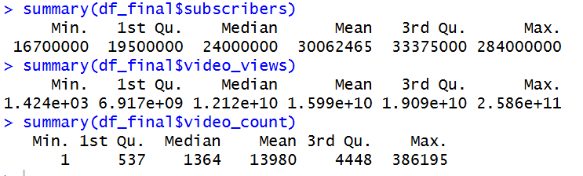
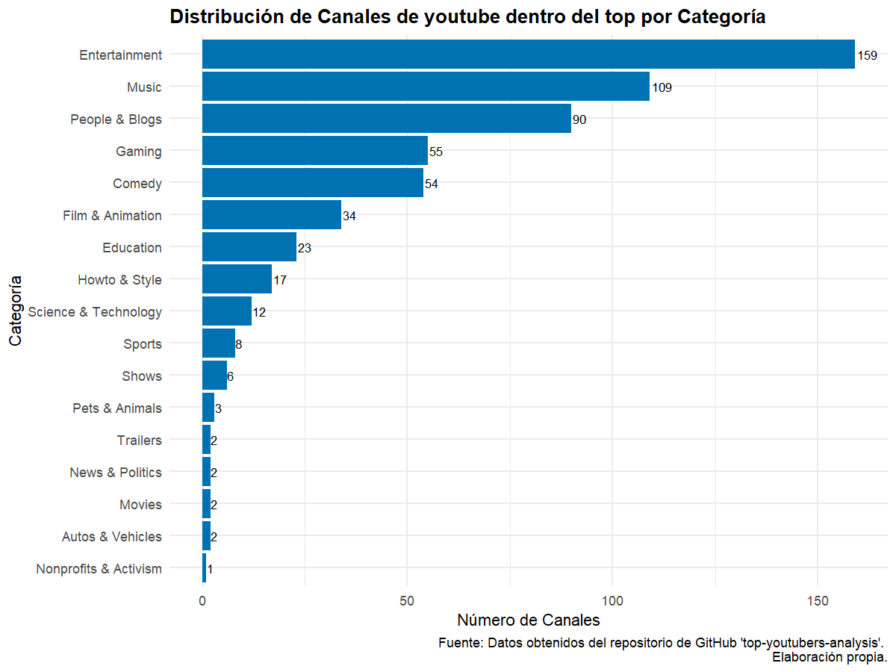
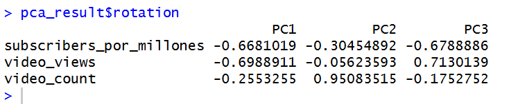

# TAREA 3: ANÁLISIS DE LAS DIMENSIONES DE ÉXITO EN CANALES TOP DE YOUTUBE


El presente trabajo tiene como propósito central identificar las dimensiones subyacentes que explican el éxito de los principales canales de YouTube hasta el año 2024. Para ello, se emplea la base de datos **“Top Youtubers Dataset.csv”**, extraída del repositorio de GitHub de **Debjit Mandal "top-youtubers-analysis"**, y se aplica un **Análisis de Componentes Principales (PCA)** sobre las variables *Subscribers*, *Video Views* y *Video Count*.

A continuación, se presenta una descripción detallada de las variables utilizadas en este análisis (definiciones sacadas del GitHub Debjit Mandal):

-   **Youtuber**: Nombre del creador de contenido o del canal de YouTube.

-   **Subscribers**: Número total de suscriptores del canal, indicador directo de su alcance y nivel de popularidad.

-   **Video Views**: Cantidad total de visualizaciones acumuladas por los videos del canal, lo que refleja tanto el grado de participación como la interacción de la audiencia.

-   **Video Count**: Número total de videos publicados por el canal, representando el volumen de contenido producido.

-   **Category**: Género o temática principal a la que pertenece el canal.

-   **Started**: Año de creación del canal.

## 1. Librerías y carga de datos

Se cargan las librerías necesarias para la manipulación, el análisis estadístico y la visualización de datos:

```{r}
library(readxl)
library(tidyverse)
library(dplyr)
library(ggplot2)
library(broom)
library(tidyr)
library(ggrepel)
library(stats)
library(kableExtra)
library(rlang)
```

## 2. Limpieza de base de datos

```{r}
df_top <- read_csv("Top Youtubers Dataset.csv")

df_top <- df_top |> 
  janitor::clean_names()

colnames(df_top)
```

Se limpia de valores faltantes y ceros, se escala a canales de élite (eliminando el 25% inferior por suscriptores), y se eliminan los *outliers* mediante el método del **Rango Intercuartílico (IQR)** para asegurar la robustez del PCA.

#### A. Filtrado inicial y escalamiento

Eliminamos nulos, ceros en métricas clave y datos anteriores a 2005.

```{r}
data_filas_sin0 <- df_top|> 
  filter(subscribers != 0,
         video_views != 0,
         video_count != 0,
         category != "na",
         !is.na(category),
         started >= 2005)
```

Luego eliminamos el 25% más pequeño de youtubers (subscribers)

```{r}
q1_value <- summary(data_filas_sin0$subscribers)["1st Qu."]

print(paste("El valor de suscriptores en el Primer Cuartil (Q1) es:", q1_value))

data_filas_sin0 <- data_filas_sin0 |> 
  filter(subscribers > q1_value)

print(paste("Número de canales en la base final para PCA:", nrow(data_filas_sin0)))

```

Luego escalamos a millones, ya que así tendremos los mismo valores, pero descritos más pequeños y fáciles de graficar en variable de subscriptores.

```{r}
summary(data_filas_sin0$subscribers)

df_final <- data_filas_sin0 |> 
  mutate(subscribers_por_millones = subscribers / 1000000)

```

#### B. Eliminamos Outliers por IQR

Se aplica el filtro IQR a las tres variables.

```{r}
summary(df_final$subscribers)
summary(df_final$video_views)
summary(df_final$video_count)

```



3.  **subscribers**

```{r}
Q1_sub <- 19500000
Q3_sub <- 33375000
IQR_sub <- Q3_sub - Q1_sub

# Calcular límites
limite_inferior_sub <- Q1_sub - 1.5 * IQR_sub
limite_superior_sub <- Q3_sub + 1.5 * IQR_sub


# Filtrar para eliminar outliers: se mantiene solo las filas donde 'subscribers' esté dentro del rango
df_final_clean <- df_final[df_final$subscribers >= limite_inferior_sub & 
                             df_final$subscribers <= limite_superior_sub, ]
```

En este caso, el máximo (284,000,000) está muy por encima del límite superior (54,187,500), por lo que será eliminado.

2.  **video_views**

```{r}
#Definir los límites para 'video_views': usamos notación científica para mayor precisión

Q1_views <- 6.917e+09
Q3_views <- 1.909e+10
IQR_views <- Q3_views - Q1_views

# Calcular límites

limite_inferior_views <- Q1_views - 1.5 * IQR_views
limite_superior_views <- Q3_views + 1.5 * IQR_views


# Filtrar el dataframe para eliminar outliers: aplicamos el filtro sobre el df que ya limpiamos de 'subscribers'

df_final_clean <- df_final_clean[df_final_clean$video_views >= limite_inferior_views & 
                                 df_final_clean$video_views <= limite_superior_views,]
```

El máximo (2.586e+11) es un outlier y será eliminado.

3.  **video_count**

```{r}
# Definir los límites para
Q1_count <- 537
Q3_count <- 4448
IQR_count <- Q3_count - Q1_count

# Calcular límites
limite_inferior_count <- Q1_count - 1.5 * IQR_count
limite_superior_count <- Q3_count + 1.5 * IQR_count


#  Filtrar el df para eliminar outliers ---
# Aplicamos el filtro final
df_final_clean <- df_final_clean[df_final_clean$video_count >= limite_inferior_count & 
                                   df_final_clean$video_count <= limite_superior_count, ]

```

El máximo (386,195) es un outlier y será eliminado.

## Gráficos exploratorios

#### A. Evolución Anual de Canales Creados

Dado que la base de datos contiene una gran variedad de categorías, se decidió realizar un recorte para determinar cuáles aparecerán en el gráfico final. Para ello, se elaboró previamente un gráfico de barras que permite visualizar la distribución de categorías y, a partir de esta exploración, identificar aquellas que son más predominantes y que, por lo tanto, serán incluidas en la visualización principal.

```{r}
#Contamos cuantos canales hay por categorías

conteo_categorias <- df_final_clean |> 
  group_by(category) |> 
  summarise(cantidad = n(), .groups = 'drop') |> 
  arrange(desc(cantidad))

#grafico de barras

grafico_barras_categorias <- ggplot(conteo_categorias, aes(x = reorder(category, cantidad), y = cantidad)) +
  geom_col(fill = "#0072B2") +
  geom_text(aes(label = cantidad), hjust = -0.1, size = 3) + 
  
  coord_flip() + 
  
  labs(title = "Distribución de Canales de youtube dentro del top por Categoría",
       x = "Categoría",
       y = "Número de Canales",
       caption = "Fuente: Datos obtenidos del repositorio de GitHub 'top-youtubers-analysis'. \nElaboración propia.") +
  theme_minimal() +
  theme(plot.title = element_text(face = "bold"))


grafico_barras_categorias
```

A partir de esta codificación, se genera el siguiente gráfico de barras:



A partir de este análisis preliminar, se determinó que para la construcción del gráfico de líneas se incluirán únicamente las **nueve categorías más predominantes**. Esta decisión permite focalizar la visualización en los grupos con mayor presencia dentro del conjunto de datos y, al mismo tiempo, evitar la sobrecarga gráfica que podría dificultar la interpretación de los resultados.

```{r}
top_categories <- df_final_clean |> 
  group_by(category) |> 
  summarise(total_count = n()) |> 
  arrange(desc(total_count)) |> 
  slice_head(n = 9) |>  
  pull(category)

top_categories


df_top_9_categories <- df_final_clean |>
  filter(category %in% top_categories)

# Agrupamos por año de inicio y categoría para contar la cantidad de canales
df_top_9_categories <- df_top_9_categories |>
  group_by(started, category) |>
  summarise(
    cantidad_canales = n(),
    .groups = 'drop'
  ) |>
  rename(year = started)

# Vistazo a los datos preparados
print(head(df_top_9_categories))

```

Ahora con esto procedemos a graficar

```{r}
grafico_lineas_evolucion <- ggplot(df_top_9_categories,
                                   aes(x = year,
                                       y = cantidad_canales,
                                       color = category,
                                       group = category)) +
  geom_line(size = 1.1) + 
  geom_point(size = 2.5) +
  scale_color_viridis_d(option = "turbo") +
  scale_x_continuous(breaks = seq(min(df_top_9_categories$year), max(df_top_9_categories$year), by = 2)) +
  scale_y_continuous(limits = c(0, max(df_top_9_categories$cantidad_canales) * 1.1)) + 
  labs(
    title = "Evolución Anual del Número de Canales Creados (Top 9 Categorías)",
    subtitle = "Tendencia en la creación de canales de YouTube desde 2005",
    x = "Año de Inicio del Canal",
    y = "Número de Canales Creados",
    caption = "Fuente: Datos obtenidos del repositorio de GitHub 'top-youtubers-analysis'. \nElaboración propia.",
    color = "Categoría de canal"
  ) +
  theme_minimal(base_size = 13) +
  theme(
    plot.title = element_text(face = "bold"),
    legend.position = "right"
  )

# Mostrar el gráfico
grafico_lineas_evolucion
```


El gráfico **“Evolución Anual del Número de Canales Creados (Top 9 Categorías)”** muestra que las categorías *Entertainment* y *Music* han sido, con diferencia, las que más canales exitosos han generado a lo largo del tiempo. Entre 2014 y 2017 se vive un momento de fuerte crecimiento, donde la creación de canales que luego se volvieron populares alcanza sus niveles más altos. En esos mismos años también aumentan *People & Blogs* y *Education*. Después de 2017, esta tendencia cambia y la cantidad de nuevos canales exitosos empieza a bajar de manera muy marcada. Esto sugiere que la plataforma comenzó a saturarse y que los canales grandes y antiguos se fueron consolidando. En los años más recientes (2022 y 2023), casi no aparecen nuevos canales dentro del grupo de los más exitosos, lo que indica que hoy es mucho más difícil entrar a ese “top”, porque quienes ya están posicionados concentran la mayor parte de la atención del público.

#### B. Disperción: videos publicados vs suscriptores

```{r}
ggplot(
  df_final_clean, 
  aes(
    x = video_count,
    y = subscribers_por_millones
  )
) +
  geom_point(color = "#8B1C62", size = 2, alpha = 0.7) +
  geom_smooth(method = "loess", color = "#0072B2") +
  scale_x_log10(labels = scales::comma, 
                breaks = c(10, 100, 1000, 10000, 100000)) + 
  scale_y_log10(labels = scales::comma, 
                breaks = c(1, 5, 10, 50, 100, 200, 300)) + 
  geom_text(
    data = df_final_clean %>% 
      filter(subscribers_por_millones > 100),
    aes(label = youtuber),
    size = 3,
    color = "black",
    check_overlap = TRUE,
    vjust = -1
  ) +
  
  labs(
    title = "Relación entre Videos Publicados y Suscriptores",
    subtitle = "Dispersión de canales de YouTube para evaluar si la cantidad de videos se correlaciona con la base de suscriptores.
Ambos ejes usan escala logarítmica.",
    x = "Cantidad de Videos por Canal (Escala Logarítmica)",
    y = "Suscriptores (Millones - Escala Logarítmica)", 
    caption = "Fuente: Datos obtenidos del repositorio de GitHub 'top-youtubers-analysis'. \nElaboración propia."
  ) +
  theme_minimal() +
  theme(
    plot.title = element_text(size = 13, face = "bold"),
    axis.title = element_text(size = 11)
  )
```


El gráfico de Relación entre Videos Publicados y Suscriptores, utilizando escalas logarítmicas en ambos ejes para mitigar el efecto de la asimetría, revela una conclusión fundamental: si bien existe una correlación positiva inicial donde un volumen bajo de videos (menos de 100) es necesario para construir la base de suscriptores, la tendencia principal indica que la cantidad masiva de videos (más de 200) tiene rendimientos decrecientes en términos de adquisición de audiencia. La línea de ajuste se aplana y se mantiene casi horizontal en el rango de 100 a 10,000 videos, mostrando una alta dispersión de puntos. Esto sugiere que, entre los canales exitosos, la calidad, el nicho o la antigüedad del canal son factores mucho más decisivos para el crecimiento de suscriptores que la simple acumulación de publicaciones.

#### C. Dispersión: vistas totales vs suscriptores

```{r}
#nos aseguramos de tener escala en millones en vistas

df_final_clean <- df_final_clean |> 
  mutate(video_views_por_millones = video_views / 1000000)

ggplot(
  df_final_clean, 
  aes(
    # Eje X: Vistas totales escaladas a millones
    x = video_views_por_millones, 
    # Eje Y: Suscriptores escalados a millones
    y = subscribers_por_millones 
  )
) +
  geom_point(color = "#4c72b0", size = 2, alpha = 0.7) + 
  geom_smooth(method = "loess", color = "#8B1C62") + 
  scale_x_log10(labels = scales::comma, 
                breaks = c(100, 1000, 10000, 100000, 1000000)) + 
  scale_y_log10(labels = scales::comma, 
                breaks = c(1, 5, 10, 50, 100, 200, 300)) + 
  geom_text(
    data = df_final_clean %>% 
      filter(subscribers_por_millones > 100 &
               video_views_por_millones < 90000),
    aes(label = youtuber),
    size = 3,
    color = "black",
    check_overlap = TRUE,
    vjust = -1
  ) +
  labs(
    title = "Relación entre Vistas Totales y Suscriptores por Canal",
    subtitle = "Dispersión de canales de YouTube entre las vistas totales del canal y la base de suscriptores. 
Ambos ejes usan escala logarítmica.",
    x = "Vistas Totales de Video (Millones - Escala Logarítmica)",
    y = "Suscriptores (Millones - Escala Logarítmica)", 
    caption = "Fuente: Datos obtenidos del repositorio de GitHub 'top-youtubers-analysis'. \nElaboración propia."
  ) +
  theme_minimal() +
  theme(
    plot.title = element_text(size = 13, face = "bold"),
    axis.title = element_text(size = 11)
  )
```

![La curva de tendencia tiene dos partes: la zona plana a la izquierda indica que en los canales medianos es muy difícil convertir las vistas en suscriptores, ya que hay mucha competencia y el crecimiento es lento. Sin embargo, al alcanzar un punto clave de popularidad (cerca de 10,000 millones de vistas), la curva se dispara hacia arriba, lo que significa que en los canales gigantes, el crecimiento se vuelve explosivo; su fama y el algoritmo de YouTube hacen que cada nueva vista genere muchos más suscriptores de manera eficiente, lo que confirma que los canales que logran pasar la fase difícil son recompensados con un crecimiento mucho más rápido.](images/clipboard-1020470643.png)

#### D. Cantidad de videos vs vistas

```{r}
ggplot(
  df_final_clean, 
  aes(
    x = video_views_por_millones, 
    y = video_count 
  )
) +
  geom_point(color = "#0072B2", size = 2, alpha = 0.7) + 
  geom_smooth(method = "lm", color = "#8B1C62") + 
  scale_x_log10(labels = scales::comma, 
                breaks = c(100, 1000, 10000, 100000, 1000000)) + 
  scale_y_log10(labels = scales::comma, 
                breaks = c(10, 100, 1000, 10000, 100000)) + 
  labs(
    title = "Relación entre Vistas Totales y Cantidad de Videos por Canal",
    subtitle = "Regresión Lineal  para encontrar relación entre las vistas y la cantidad de videos. 
Ambos ejes usan escala logarítmica.",
    x = "Vistas Totales de Video (Millones - Escala Logarítmica)",
    y = "Cantidad de Videos por Canal (Escala Logarítmica)", 
    caption = "Fuente: Datos obtenidos del repositorio de GitHub 'top-youtubers-analysis'. \nElaboración propia."
  ) +
  theme_minimal() +
  theme(
    plot.title = element_text(size = 13, face = "bold"),
    axis.title = element_text(size = 11)
  )
```

![El gráfico nos muestra si subir más videos ayuda a un canal a tener más vistas en total. Vemos una línea recta ascendente que confirma que, en promedio, sí hay una relación positiva: los canales que han subido más videos (Eje Y) suelen tener más vistas (Eje X). Sin embargo, el gran esparcimiento de puntos alrededor de esa línea nos dice que el volumen no lo es todo. Por ejemplo, hay canales que han subido muchísimos videos, pero no han acumulado tantas vistas (quedan por encima de la línea), mientras que otros canales han subido pocos videos pero han tenido un éxito enorme en vistas (quedan por debajo de la línea, en la parte derecha). Esto significa que aunque subir mucho contenido ayuda, la clave para el éxito masivo podría ser la eficiencia o la calidad de los videos, pues unos pocos videos virales pueden superar el volumen de miles de videos de bajo impacto.](images/clipboard-2115339901.png)

#### E. Gráfico de barras: Suma total de suscriptores por categoría

```{r}
# 1. Agrupar y Sumar Suscriptores por Categoría
# Calculamos el total de suscriptores (en millones) para cada categoría
df_subs_por_categoria <- df_final_clean |>
  group_by(category) |>
  summarise(
    total_subscribers_millones = sum(subscribers_por_millones, na.rm = TRUE),
    .groups = 'drop'
  ) |>
  arrange(desc(total_subscribers_millones))

# 2. Generar el Gráfico de Barras
grafico_subs_por_categoria <- ggplot(
  df_subs_por_categoria, 
  aes(
    x = reorder(category, total_subscribers_millones), 
    y = total_subscribers_millones
  )
) +
  geom_col(fill = "#8B1C62")+ 
  geom_text(
    aes(label = round(total_subscribers_millones, 0)), 
    hjust = -0.1, 
    size = 3
  ) +
  coord_flip() + 
  
  labs(
    title = "Suma Total de Suscriptores por Categoría de YouTube",
    subtitle = "Suscriptores acumulados (en millones) por las categorías principales",
    x = "Categoría",
    y = "Suscriptores Totales Acumulados (en Millones)",
    caption = "Fuente: Datos obtenidos del repositorio de GitHub 'top-youtubers-analysis'. \nElaboración propia."
  ) +
  scale_y_continuous(expand = expansion(mult = c(0, 0.15))) + 
  theme_minimal() +
  theme(
    plot.title = element_text(face = "bold", size = 14),
    axis.title = element_text(size = 11)
  )

# Mostrar el gráfico
grafico_subs_por_categoria
```


El gráfico de barras muestra qué tipos de contenido de YouTube acumulan la mayor cantidad total de suscriptores sumando todos los canales de esa categoría. Claramente, las categorías de Entertainment (Entretenimiento, con 3961 millones de suscriptores) y Music (Música, con más de 2925 millones) dominan por completo, lo que significa que la audiencia global de los principales YouTubers se concentra en ver contenido divertido y musical. Las categorías como People & Blogs, Gaming y Comedy también son muy fuertes y acumulan miles de millones de suscriptores, mientras que los nichos como Noticias o Deportes, aunque importantes, tienen una base total de suscriptores mucho menor en este grupo de canales principales. Esto refleja las preferencias generales de los espectadores de YouTube, que tienden a gravitar hacia el entretenimiento y la música por encima de otros tipos de contenido.

#### F. Conclusión preliminar

La conclusión preliminar obtenida de los gráficos exploratorios es que el éxito en YouTube en la muestra de canales de élite se rige por la Magnitud de Audiencia (Vistas y Suscriptores, que se refuerzan mutuamente) y, en menor medida, por la Estrategia de Contenido. Los datos sugieren que la plataforma sufrió una saturación histórica después de 2017, dificultando la entrada de nuevos canales exitosos. Además, la relación entre Vistas y Suscriptores muestra un punto de inflexión clave (cerca de 10,000 millones de vistas) donde el crecimiento se vuelve exponencial, mientras que la cantidad masiva de videos (video_count \>200) tiene rendimientos decrecientes en la adquisición de suscriptores, lo que implica que la calidad, la viralidad o la antigüedad son factores que pueden ser más determinantes para el éxito a largo plazo que la simple acumulación de publicaciones.

## 4. Análisis de Componentes Principales (PCA)

El objetivo del PCA es reducir la complejidad de las tres métricas de éxito y lograr la máxima simplificación con la mínima pérdida de información.

#### A. Estandarización de variables y ejecución del PCA

Antes de aplicar el PCA, es crucial **estandarizar** las variables (transformación Z-core) para evitar que la magnitud gigante de **video_views** (Vistas) domine el análisis.

```{r}
df_pca_select <- df_final_clean |> 
  select(subscribers_por_millones, video_views, video_count)
```

Acabamos de tomar nuestras tres ingredientes principales para el éxito de un canal de YouTube: Suscriptores, Vistas, Cantidad de Videos. Ante esto, aplicaremos la normalización (Estandarización: media=0, desviación estándar=1) Esto es necesario para evitar que 'video_views' domine por su gran magnitud.

```{r}
df_pca_normal <- scale(df_pca_select)

head(df_pca_normal)
```

Luego, aplicamos PCA: esto sifnifica que aplicamos PCA para ver si podías combinar estos tres ingredientes en menos "sabores" sin perder el gusto.

```{r}
pca_result <- prcomp(df_pca_normal)

summary(pca_result)
```


-   **PC1:** es el componente más importante del análisis. Puede entenderse como el “tamaño del canal” o la “popularidad general”. Esto significa que Explica el 50,29% de la variabilidad total, lo que indica que las tres variables: *Subscribers*, *Video Views* y *Video Count*, están fuertemente relacionadas entre sí. Es decir, cuando un canal destaca en una de estas métricas, normalmente también lo hace en las otras. En conclusión, el PC1 revela un factor común que resume la magnitud global del canal.

-   **PC2:** Al sumar PC1 y PC2, se alcanza el 82,95% de toda la información contenida en los datos. Esto es una excelente señal, porque significa que ya no es necesario usar las tres variables originales. Basta con trabajar con dos nuevos componentes (PC1 y PC2) para conservar casi toda la información, perdiendo solo un 17,05%.

-   **PC3:** El PC3 es el componente menos relevante, explicando solo el 17,05% de la variabilidad. Este componente recoge diferencias más finas entre los canales. Por ejemplo, puede resaltar casos donde un canal tiene muchos videos, pero relativamente pocos suscriptores o vistas, o lo contrario. Sin embargo, aunque aporta matices, no resulta esencial para describir el comportamiento general de los canales.

A continuación, se analizan las **cargas de cada variable en los componentes**, lo cual permitirá asignar nombres y significados más interpretables a nuestros dos componentes principales: **PC1** y **PC2**.

#### B. Interpretación de la rotación

Las cargas (loadings) indican cuánto aporta cada variable original a la construcción de cada componente principal. En otras palabras, muestran qué tan fuerte se relaciona una variable con un componente. Por ejemplo, si *subscribers_por_millones* presenta una carga elevada en el PC1, significa que esta variable es especialmente importante para definir ese componente.

Estas cargas funcionan como una medida de correlación: mientras más cerca esté el valor de 1 o –1, más fuerte es la relación entre la variable original y el componente. Valores cercanos a 0 indican una contribución débil o poco relevante.

```{r}
pca_result$rotation
```



El PC1 explica el **50,29%** de la variabilidad total y presenta las siguientes cargas:

-   Suscriptores: muy fuerte (-0.668)

-   Vistas: muy fuerte (-0.699)

-   Número de videos: débil (-0.255)

Este componente representa la Magnitud, Popularidad o Éxito General del canal. Un valor muy negativo en PC1 indica que el canal tiene simultáneamente muchos suscriptores y muchas vistas. En otras palabras, el PC1 captura el factor común que define el éxito global en YouTube.

El PC2 explica el **32,66%** de la varianza (acumulando **82,95%** junto con el PC1). Sus cargas son:

-   **Número de videos:** extremadamente fuerte (+0.951)

-   **Suscriptores:** carga baja (-0.305)

-   **Vistas:** carga casi nula (-0.056)

El PC2 refleja la Estrategia o el Volumen de Contenido. Este componente está impulsado casi por completo por la cantidad de videos publicados.\
Un valor alto en PC2 significa que el canal basa su éxito en publicar muchos videos, mientras que un valor bajo indica canales que logran posicionarse con pocos videos pero de alto impacto. Así, el PC2 permite distinguir entre “cantidad” versus “efectividad” en la estrategia de contenido.

Aunque el PC3 es descartado, es útilo para entender diferencias sutiles. El PC3 recoge la variabilidad restante y muestra una diferencia importante entre las métricas de audiencia. Sus cargas son:

-   **Suscriptores:** carga negativa alta (-0.679)

-   **Vistas:** carga positiva alta (+0.713)

Este componente refleja un **trade-off** entre suscriptores y vistas.

-   Un canal con un **PC3 alto** tiene muchas vistas en relación con sus suscriptores.

-   Un canal con un **PC3 bajo** tiene muchos suscriptores, pero genera relativamente menos vistas.

En términos simples, el PC3 compara la **eficiencia de conversión** entre quién te sigue y cuántas vistas realmente genera tu contenido.

## 5. Visualización 

```{r}
df_pca_2 <- df_pca_normal |> 
  prcomp()

df_pca_2

df_pca_2 |> 
  broom::tidy(matrix = "eigenvalues") |> 
  kable() |> 
  head(n = 10)
df_pca_2 |> 
  broom::tidy(matrix = "rotation") |> 
  kable() |> 
  head(n = 10)


df_pca_2 |>
  broom::tidy(matrix = "scores") |> 
  pivot_wider(names_from = "PC",
              names_prefix = "PC_",
              values_from = "value") |>
  kable() |> 
  scroll_box() 

df_pca_2_cat <- df_pca_2 |>
  broom::tidy(matrix = "scores") |> 
  pivot_wider(names_from = "PC",
              names_prefix = "PC_",
              values_from = "value") |> 
  bind_cols(df_final_clean)

head(df_pca_2_cat)
```

#### A. Dispersión + curvas de densidad

```{r}
colores_gradiente <- c("#990066", "#cc3399", "#ff6600", "#ffcc00")

colores_paises <- c("#cc3399","#ff6600","#ff9900","#006699")

colores_scree <- c("#99cc33", "#3399cc", "#cc3399", "#ff9900")

df_pca_2_cat |> 
  ggplot(aes(x = PC_1, y = PC_2)) +
  geom_point(alpha = 0.5, size = 0.2) +
  labs(x = "Componente 1 (64,5%)",
       y = "Componente 2 (10%)") +
  theme_linedraw() +
  theme(legend.position = "none")


#Agregamos *kernel density estimation*:
  
df_pca_2_cat |> 
  ggplot(aes(x = PC_1, y = PC_2)) +
  geom_point(alpha = 0.5, size = 0.2) +
  geom_density_2d(aes(color = after_stat(level)), linewidth = 0.8) +
  scale_color_gradientn(colours = colores_gradiente) +
  labs(x = "Componente 1 (50.29
       %)",
       y = "Componente 2 (32.66%)") +
  theme_linedraw() +
  theme(legend.position = "none")

```

![El gráfico muestra cómo se distribuyen los canales de YouTube en las dos nuevas dimensiones creadas por el PCA. Cada punto es un canal, y las líneas de colores indican las zonas donde hay mayor o menor concentración de ellos: mientras más cerradas están las curvas, más canales se acumulan ahí. Lo que se observa es que la gran mayoría de los canales se agrupa hacia la parte derecha del gráfico, lo que significa que comparten un patrón similar en las variables originales (suscriptores, vistas y videos). En cambio, los puntos que aparecen dispersos hacia la izquierda representan canales menos comunes o con comportamientos distintos al promedio. Así, el gráfico permite ver de manera simple tanto la forma del “grupo principal” como los canales que se alejan del patrón general.](images/clipboard-3373026109.png)

#### B. BIPLOT

```{r}
# 1. Definir un factor de escala para las flechas (vectores)
factor_escala <- 8 

# 2. ESCALAMOS LA ROTACIÓN 
df_pca_rotation_scaled <- df_pca_rotation |>
  mutate(
    PC_1_scaled = PC_1 * factor_escala,
    PC_2_scaled = PC_2 * factor_escala
  )

df_pca_scores |>
  ggplot(aes(x = PC_1, y = PC_2)) +
  geom_hline(yintercept = 0, color = "grey80") +
  geom_vline(xintercept = 0, color = "grey80") +
  
  # 1. Puntos (Canales) - Coloreados por la Categoría
  geom_point(aes(color = category), 
             alpha = 0.5,
             size = 1.5) +
  
  # 2. Vectores (Flechas) - Usamos el df_pca_rotation_scaled
  geom_segment(
    data = df_pca_rotation_scaled,
    mapping = aes(
      x = 0,
      xend = PC_1_scaled,
      y = 0,
      yend = PC_2_scaled
    ),
    color = "#cc3399", 
    arrow = arrow(length = unit(0.2, "cm"), type = "closed")
  ) +
  
  # 3. Etiquetas de Variables
  geom_label_repel(
    data = df_pca_rotation_scaled,
    aes(
      x = PC_1_scaled,
      y = PC_2_scaled,
      label = variable 
    ),
    color = "#990066",
    fill = "#FFFFFF80",
    size = 3
  ) +
  
  # 4. Títulos y Etiquetas CORREGIDOS con tus valores de varianza
  labs(
    x = "PC1 (50.29%)", 
    y = "PC2 (32.66%)", 
    title = "Biplot: Canales de YouTube en las Dimensiones de Éxito",
    color = "Categoría" 
  ) +
  theme_linedraw() +
  theme(legend.position = "bottom")
```

![El biplot muestra cómo se distribuyen los canales según dos grandes dimensiones del PCA: el PC1, que refleja el nivel de éxito general (suscriptores y vistas), y el PC2, que representa el volumen de contenido (cantidad de videos). Los puntos, diferenciados por categoría, revelan que la mayoría de los canales se agrupa en la zona derecha del PC1, lo que indica que comparten un patrón similar en términos de éxito. Las flechas muestran la dirección e intensidad de cada variable original: “subscribers_por_millones” y “video_views” apuntan casi en la misma dirección, lo que significa que ambas variables se mueven juntas y definen principalmente el PC1; en cambio, “video_count” apunta hacia abajo, mostrando que es la variable que distingue al PC2. Esto quiere decir que un canal situado hacia la derecha tiene más éxito general, mientras que uno que aparece más abajo tiende a lograr ese éxito produciendo una gran cantidad de videos. En síntesis, el gráfico permite ver no solo cómo se agrupan los canales según su comportamiento, sino también qué variables impulsan cada eje y qué tipo de estrategia caracteriza a cada zona del espacio.](images/clipboard-3838355533.png)

#### C. Barras de cargas factoriales

```{r}
# 1. Prepara los datos de Rotación para el gráfico de barras
# df_pca_rotation debe tener las columnas 'variable', 'PC_1', 'PC_2', 'PC_3'
df_pca_loadings_bar <- df_pca_rotation |>
  select(variable, PC_1, PC_2) |> # Seleccionamos solo PC1 y PC2
  pivot_longer(names_to = "pca", values_to = "valor_pca", cols = c(PC_1, PC_2))

# 2. Graficamos las cargas de las variables en PC1 y PC2
df_pca_loadings_bar |>
  ggplot(aes(x = fct_reorder(variable, valor_pca), y = valor_pca)) +
  geom_col(fill = "#006699") + 
  geom_hline(yintercept = 0) +
  
  # Etiquetas de valor
  geom_text(aes(label = round(valor_pca, 2),
                y = if_else(valor_pca >= 0,
                            valor_pca + 0.05,  
                            valor_pca - 0.05)), 
            size = 3) +
  
  coord_flip() +
  facet_grid(cols = vars(pca),
             labeller = labeller(
               PC1 = "Componente 1 (50.29%)", 
               PC2 = "Componente 2 (32.66%)"
             )) +
  labs(x = NULL,
       y = "Peso de la Variable (Carga)",
       title = "Cargas Factoriales en PC1 y PC2") +
  theme_linedraw()
```

![El gráfico muestra qué variables son las que más influyen en cada componente. En el primer componente (PC1), lo que más pesa son los suscriptores y las visualizaciones: estas dos variables son las que realmente están “armando” este eje, así que PC1 representa muy bien el nivel de éxito o popularidad de un canal. En cambio, la cantidad de videos casi no influye aquí. En el segundo componente (PC2) ocurre lo contrario: prácticamente todo el peso lo tiene la cantidad de videos publicados, lo que significa que este eje resume el nivel de producción o cuánto contenido sube un canal. Los suscriptores y las visualizaciones aportan muy poquito a esta segunda dimensión. En pocas palabras: **PC1 mide éxito; PC2 mide volumen de contenido**.](images/clipboard-1600986597.png)
